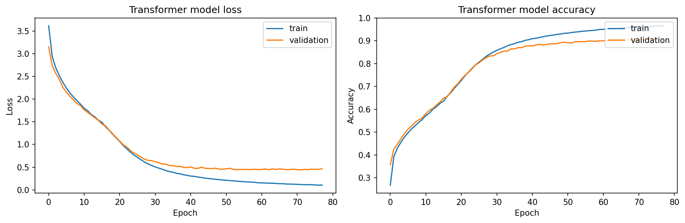
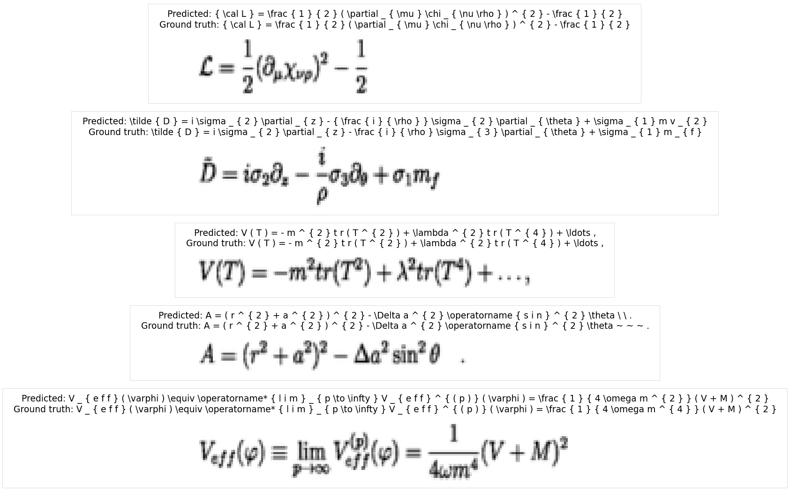
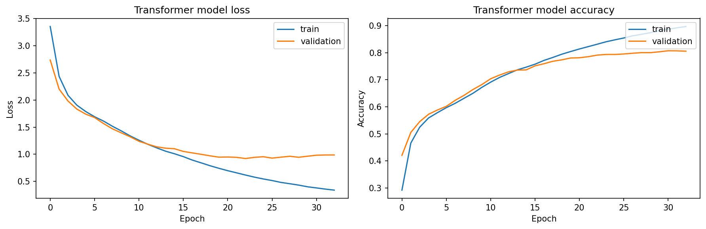
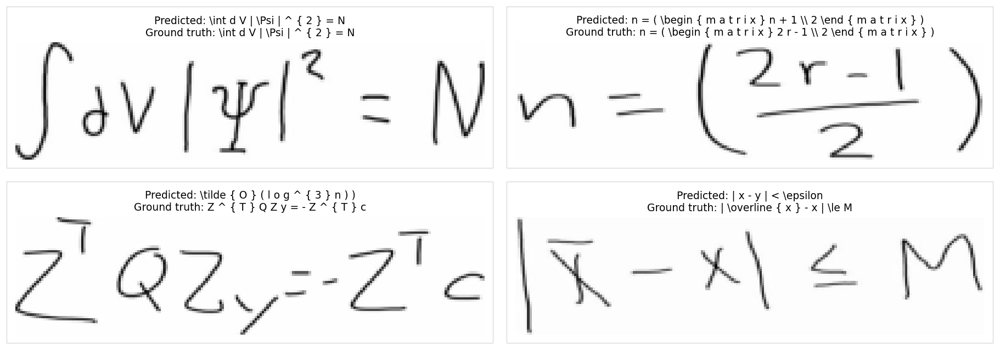
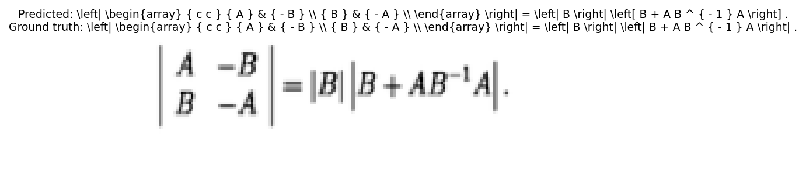
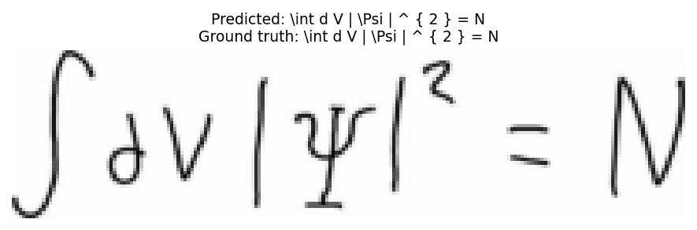
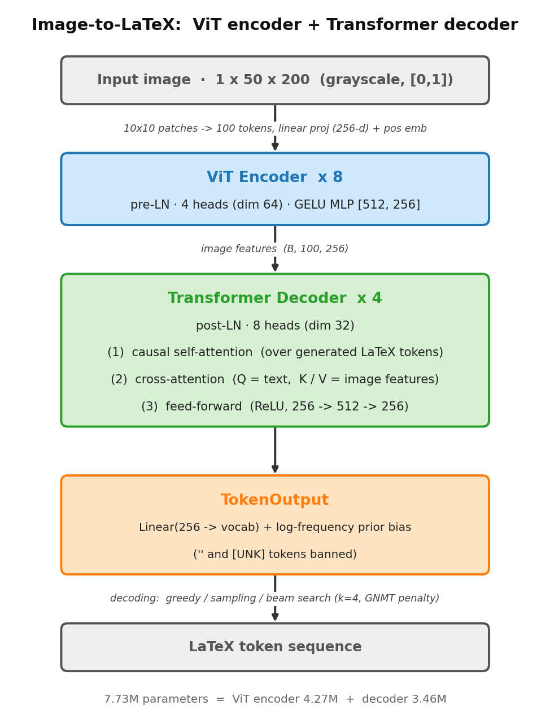

# ViT Image-to-LaTeX — Printed & Handwritten Math Expression Recognition

**English** | [中文](README.zh-CN.md)

> An end-to-end **Vision Transformer encoder + Transformer decoder** that converts
> images of mathematical formulas into LaTeX token sequences (PyTorch). Trained and
> evaluated on both **printed** (`im2latex-100k`) and **handwritten**
> (`MathWriting-human`) formulas with an *identical* architecture and training recipe.
> This repository also contains the full thesis ([`Document/main.pdf`](Document/main.pdf), in Chinese).


A lightweight (**7.73M parameters**) pure-Transformer model frames formula recognition as
image captioning: image → ViT patch features → autoregressive decoder → LaTeX tokens.
No CNN backbone, no language-specific grammar rules — structure is learned end-to-end.

---

## Key results

Evaluated on each dataset's **independent test split**. Masked loss/accuracy are computed
with teacher forcing; BLEU-4 is computed in **fully autoregressive** generation (500 test
samples, NLTK `method1` smoothing) and is the headline generation metric.

| Dataset | Vocab | Test acc (teacher forcing) | BLEU-4 (greedy) | BLEU-4 (beam, k=4) |
|---|:---:|:---:|:---:|:---:|
| **im2latex-100k** (printed) | 504 | **90.14 %** | 0.6767 | **0.7012** |
| **MathWriting-human** (handwritten) | 235 | 56.63 % | 0.0833 | 0.0786 |

- On **printed** formulas, the 7.73M-parameter model with low-resolution `50×200` inputs
  reaches **0.70 BLEU-4**, validating a pure-Transformer approach to the task.
- The **handwritten** experiment is a strictly controlled transfer study (same recipe,
  same 50k training samples): the large drop quantifies the difficulty of cross-writer
  generalization rather than claiming a strong handwriting recognizer.

| Training curves (printed) | Predictions vs. ground truth (printed) |
|---|---|
|  |  |

| Training curves (handwritten) | Predictions vs. ground truth (handwritten) |
|---|---|
|  |  |

The handwritten curves show the earlier, larger overfitting (validation loss bottoms out
around epoch 23 while training loss keeps falling) discussed in the analysis above.

| Printed sample (array / determinant) | Handwritten sample (∫dV |Ψ|² = N, correct) |
|---|---|
|  |  |

---

## Architecture

<p align="center">
  
</p>

| | |
|---|---|
| Input | `50 × 200` grayscale, `10 × 10` patches → 100 patches |
| Embedding dim | 256 |
| Encoder | 8 layers, 4 heads, pre-LN, GELU MLP `[512, 256]` |
| Decoder | 4 layers, 8 heads, post-LN, ReLU FFN `512 → 256` |
| Parameters | **7.73M** (encoder 4.27M + decoder 3.46M) |
| Max sequence length | 152 (incl. `[START]`/`[END]`) |

**Training recipe.** AdamW (`β1=0.9, β2=0.98, ε=1e-9`, weight decay `1e-4`) with the
original Transformer warmup schedule (`d_model⁻⁰·⁵·min(t⁻⁰·⁵, t·warmup⁻¹·⁵)`, warmup 800,
peak LR ≈ `2.2e-3`), **global-norm gradient clipping at 1.0**, batch size 768, dropout 0.1,
masked cross-entropy (padding ignored), a seeded random 80/20 train/val split, and early
stopping (patience 10, best weights restored). The output layer adds a **log-frequency
prior bias** fitted on the training-label distribution.

---

## Key findings

- **Gradient clipping is mandatory, not optional.** At batch 768 near the warmup LR peak,
  an unclipped run diverged at epoch 7 and collapsed to emitting only `{`/`}` (accuracy
  pinned at the ~16.4 % marginal frequency). Clipping at 1.0 + warmup 800 made training
  stable across both datasets.
- **Teacher-forcing accuracy overestimates generation quality.** 90.14 % token accuracy
  but 0.68–0.70 BLEU-4 — the gap is autoregressive error accumulation, so BLEU is reported
  as the real-usage metric.
- **Beam search helps only a well-calibrated model.** +0.0245 BLEU on printed formulas, but
  **no gain** on the underfit handwritten model — a useful negative control.
- **Printed → handwritten gap** decomposes into (1) writer distribution shift
  (val 79 % vs. test 56.63 %), (2) insufficient data / overfitting, and (3) aspect-ratio
  distortion from resizing near-square handwriting into `50×200`.

---

## Repository structure

```
.
├── Code/                       # PyTorch implementation (the vit_latex package)
│   ├── main.py                 # entry point: train + evaluate pipeline
│   ├── vit_latex/
│   │   ├── config.py           # all hyperparameters + DATASETS registry
│   │   ├── data/               # LaTeX tokenizer + image preprocessing / HF loading
│   │   ├── models/             # ViT encoder, decoder blocks, full captioner + beam search
│   │   ├── training/           # masked metrics, warmup scheduler, training loop
│   │   └── evaluation/         # eval, BLEU, visualization, interactive demo
│   ├── tests/                  # pytest suite (CPU-only, fast)
│   └── outputs/                # run artifacts (figures, demo images)
└── Document/                   # Full thesis (XeLaTeX, Chinese) — see main.pdf
    ├── main.pdf                # prebuilt thesis PDF
    ├── body/                   # method / training / model / results chapters
    └── pic/                    # figures
```

See [`Code/README.md`](Code/README.md) for code-level details.

---

## Getting started

Python **3.11+**, PyTorch **≥2.1** (the reported results used PyTorch 2.12 on a single
NVIDIA RTX 5090, 32 GB).

```bash
cd Code
uv sync                      # or: pip install -r requirements.txt
```

### Train & evaluate

```bash
python main.py                                   # train + evaluate on im2latex (printed)
python main.py --dataset mathwriting --beam      # handwritten + greedy-vs-beam BLEU
python main.py --eval-only [--weights PATH]      # evaluate saved weights, skip training
```

The first run downloads the dataset from Hugging Face and uses the GPU automatically when
available. Artifacts for non-default datasets get a `_<dataset>` filename suffix so runs do
not overwrite each other.

### Tests

```bash
pytest        # 25 tests, CPU-only
```

---

## Datasets

| | Source (Hugging Face) | Type |
|---|---|---|
| `im2latex-100k` | [`yuntian-deng/im2latex-100k`](https://huggingface.co/datasets/yuntian-deng/im2latex-100k) | printed, pre-tokenized formulas |
| `MathWriting-human` | [`deepcopy/MathWriting-human`](https://huggingface.co/datasets/deepcopy/MathWriting-human) | handwritten, raw LaTeX (tokenized on load) |

50,000 training samples are used per dataset (capped for a fair comparison); the test split
is each dataset's own independent split (2,000 samples).

---

## The thesis

[`Document/main.pdf`](Document/main.pdf) is the full thesis (Chinese), covering Transformer
& ViT theory, training principles, model construction, and a detailed results / error
analysis. To rebuild (XeLaTeX + biber, `-shell-escape` for `minted`):

```bash
cd Document
latexmk -xelatex -shell-escape main.tex
```

---

## References

- Vaswani et al., 2017. *Attention Is All You Need* (warmup schedule §5.3, beam search §6.1).
- Dosovitskiy et al., 2021. *An Image is Worth 16×16 Words* (ViT).
- Wu et al., 2016. *Google's Neural Machine Translation System* (GNMT length penalty).
- Loshchilov & Hutter, 2019. *Decoupled Weight Decay Regularization* (AdamW).
- Datasets: Deng et al. (im2latex-100k); Gervais et al., 2025 (MathWriting).

## License

The source code in this repository is released under the [MIT License](LICENSE).
The trained model is evaluated on third-party datasets (im2latex-100k, MathWriting-human),
and the thesis (`Document/`) may include third-party figures; those remain under the rights
of their respective owners.
